# Proposal: Solutions CMakeLists Generation

In csolution it is possible to describe several projects and build-types/target-types resulting in several contexts and several build artifacts which may have inter-dependencies. To replace the `CPRJ` with `cbuild.yml` format and re-implement the CMakeLists.txt generation the following topics are being investigated:

- generating CMakeLists for inter-dependent multi-context solutions
- handling multiple toolchains in the same solution
- modular generation of CMake targets allowing its integration with other CMake based projects and/or build plates (i.e. crossplatform toolchain specific handling)
- integration of existing images (that are i.e. generated using CMake)​
- pre/post-build steps

## 1. Overview

The following diagram gives an overview of the current proposal considering all elements needed or recommended for reaching the above enumerated goals. A practical example addressing some of these concepts can be found in the [example](example/README.md) folder.



## 2. Single vs multiple CMake Projects

One common approach of describing related CMake projects, with or without inter-dependencies, is adding them to an entry point `CMakeLists.txt` using the function [`add_subdirectory`](https://cmake.org/cmake/help/latest/command/add_subdirectory.html):



All CMake targets are visible and it is easy to set dependencies using [`add_dependencies`](https://cmake.org/cmake/help/latest/command/add_dependencies.html).
However it has the following drawbacks:
- Only one toolchain per language is supported.
- The `configure` step is common to all targets, leading to the generation of a single [`compile_commands.json`](https://cmake.org/cmake/help/latest/variable/CMAKE_EXPORT_COMPILE_COMMANDS.html) for all subprojects.
- It makes difficult the integration of an external stand-alone project in the same solution.


To overcome such limitations it would be advisable to use the [`ExternalProject`](https://cmake.org/cmake/help/latest/module/ExternalProject.html#externalproject) functions:



[Example](example/tmp/CMakeLists.txt#L70): SuperProject CMakeLists orchestrating contexts as external projects.

This allows to run individual steps such as `configure` and `build` independently, enabling the use of a different toolchain for each context as well as the generation of a compilation database at context level. The steps can be managed as CMake targets via [`ExternalProject_Add_StepTargets`](https://cmake.org/cmake/help/latest/module/ExternalProject.html#command:externalproject_add_steptargets) as well as [`ExternalProject_Add_StepDependencies`](https://cmake.org/cmake/help/latest/module/ExternalProject.html#command:externalproject_add_stepdependencies).

A possible disadvantage of this pattern is the superfluous overhead introduced by the CMake Compiler Detection phase when several contexts use the same toolchain. A custom step to optionally run the compiler detection just once per toolchain could be developed to overcome this drawback.

## 3. Generating Portable CMakeLists

Toolchain configuration data and CMakeLists could be generated without explicit absolute paths nor references to the CMSIS-Toolbox installation files, making them portable.
For reaching this goal the destination platform must be properly configured: the environment variable `CMSIS_PACK_ROOT` must be set, the CMSIS-Pack repository must be initialized, the needed packs downloaded and installed, the needed toolchains should be installed and properly registered via environment variables `<name>_TOOLCHAIN_<major>_<minor>_<patch>`.

## 4. Simplifying Toolchain Configuration

The experience with the current Build Manager has shown communalities among the different embedded toolchains are frequent while newer versions usually bring only small deltas. Also a better machine-readable format such as YML/JSON would be preferred over *.cmake files allowing tools such as the Project Manager to easily read information that is currently only available at the CMake running phase.
For this reason the suggestion here is to keep the common functions in *.cmake templates and shift the toolchain specific data into YML files. For example this could be a snippet of a hypothetical `AC6.yml` file:
```yml
toolchain-options:
  cpu:
    - for-compiler: AC6@>=6.6
      Cortex-M3: -mcpu=Cortex-M3
    - for-compiler: AC6@>=6.18
      Cortex-M85: -mcpu=Cortex-M85
```

## 5. Using CMakeLists templates

For the customization of the generated `CMakeLists.txt` at solution and/or at context level in a persistent way, avoiding overwriting when regenerating them, a possible approach is to use customizable templates.
In a similar way the toolchain configuration *.cmake files could also benefit from customizable templates.

## 6. Generating decoupled CMSIS components build information

CMake targets describing components build information and user files build information could be placed in modules separately from the toolchain specific handling, the so-called build plate, enabling their use from different tools and build systems.

[Example](example/tmp/project/ARMCM3/App/CMakeLists.txt#L25): [`groups.cmake`](example/tmp/project/ARMCM3/App/groups.cmake) and [`components.cmake`](example/tmp/project/ARMCM3/App/components.cmake) are generated/placed separately.

## 7. Pre/post-build steps

A build-run is inherently related to a context. In addition to solution level pre/post-build steps that run before/after all build-runs, individual context pre/post-build steps should be also accepted. Rather then placing `execute` nodes under `projects`, it sounds natural to specify them at solution or at context level. 
Input and output files should be also considered for correctly triggering pre/post-build steps, unless they are intended for running always unconditionally. The `execute` node alongside a `file` has an obvious implicit output and can be omitted.

`csolution.yml` example:
``` yml
solution:
  executes:
    - execute: Run solution prebuild
      run: generate-keys.sh
      always: true
      output:
        - generated/keys.h
    
    - execute: Run solution postbuild
      run: zip-artifacts.sh
      input:
        - $elf(project.App+ARMCM3)$
        - $lib(project.AC6+ARMCM3)$
        - $lib(project.GCC+ARMCM3)$
      output:
        - archives/artifacts.zip
```

`cproject.yml` example:
``` yml
project:
  executes:
    - execute: Run context prebuild
      run: generate-debug-src.sh
      output:
        - generated/Debug/$TargetType$.c
      for-context: .Debug      
    
    - execute: Run context postbuild
      run: sign-artifacts.sh
      input:
        - $lib()$
      output:
        - $OutDir()$/project.signed.lib
```
Examples of possible CMakeLists implementation:
- [Example 1](example/tmp/CMakeLists.txt#L110): Solution level pre-build step, run always.
- [Example 2](example/tmp/CMakeLists.txt#L119): Solution level post-build step, depends on all contexts build artifacts.
- [Example 3](example/tmp/CMakeLists.txt#L90): Context level pre-build step, run always.
- [Example 4](example/tmp/CMakeLists.txt#L95): Context level post-build step, depends on context build artifact.

## 8. CMake hooks - extra use cases

### 8.1 Add generic CMake based library

A generic CMake based library does not bring a build plate, i.e. it does not have crossplatform settings for building it with any embedded toolchain in particular. It is expected to have a parent CMake project that configures the crossplatform environment.
In the current proposal it can be added via custom templates or by extending the csolution specification to accept external projects.



See [Using CMakeLists templates](#5-using-cmakelists-templates).

`csolution.yml` example:
``` yml
solution:
  projects:                                   
    - project: ./CMakeGenericLibrary
      cmake: generic # [standalone|generic]
      input:
        - $lib(AnotherLib)$
      output:
        - generic.lib
      for-context: .Release
```

### 8.2 Add stand-alone CMake based project

Stand-alone CMake based projects are fully configured and don't need a build plate. Also in such cases it is possible to integrate it via custom templates or by extending the csolution specification.


See [Using CMakeLists templates](#5-using-cmakelists-templates).

`csolution.yml` example:
``` yml
solution:
  projects:                                   
    - project: ./CMakeStandaloneProject
      cmake: standalone # [standalone|generic]
      input:
        - $OutDir(CMakeGenericLibrary.Release+ARMCM3)$/generic.lib
      output:
        - out/standalone.elf
```

### 8.3 Add CMSIS components into stand-alone CMake based project

In this use case CMSIS Components are integrated into existing stand-alone CMake based projects.
The user's CMSIS components selection/configuration needs to be translated in csolution yml files that are then processed by the Project Manager, generating cbuild.yml files and finally the CMSIS generic build info is added to the stand-alone project.
A proof-of-concept for such CMake Module has been developed:
[CMSIS-Pack-Utils](https://github.com/brondani/cmsis-pack-utils). 



See [Generating decoupled CMSIS components build information](#6-generating-decoupled-cmsis-components-build-information).

## 9. Suggestions for optimizations

- The [`CMake binary directory`](https://cmake.org/cmake/help/latest/variable/CMAKE_BINARY_DIR.html) of each context could be named according to its index (ordinal number) instead of its full context name and placed right after the intermediate base directory. This strategy would lead to the shortest possible object file paths.

## 10. Specification needs

- The intermediate and output directory customization [`output-dirs`](https://github.com/Open-CMSIS-Pack/cmsis-toolbox/blob/main/docs/YML-Input-Format.md#output-dirs) is targeted at context level. In particular the `intdir` would need to be amended: in the multi-context scenario a solution level intermediate directory is needed to store the top-level `CMakeLists.txt`.
- Context inter-dependencies retrieved from context related [access sequences](https://github.com/Open-CMSIS-Pack/cmsis-toolbox/blob/main/docs/YML-Input-Format.md#access-sequences) should be added to cbuild-idx.yml file. 
- The `projects` references should accept external CMake based libraries and stand-alone projects.
- The `execute` node should accept input and output files assignment.

## 11. Test and development needs

A test plan for the migration of integration test cases should be developed before the implementation of the new context-level CMakeLists, enabling its test-driven development.
