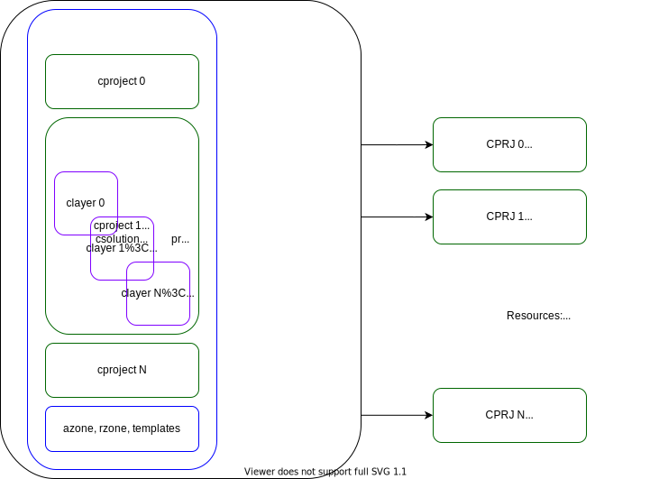
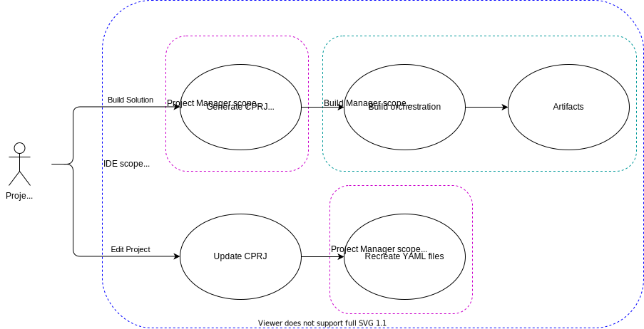
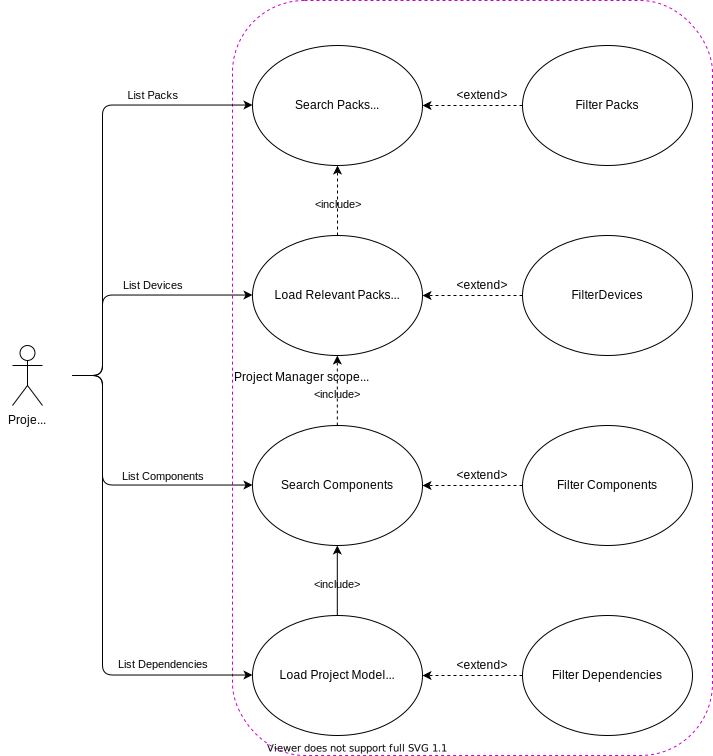
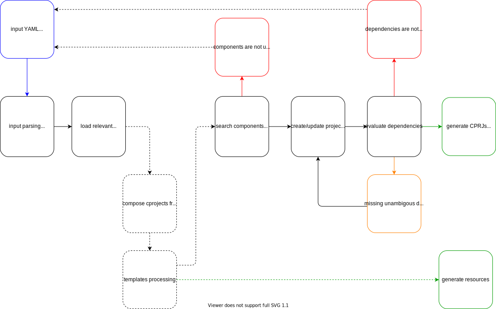
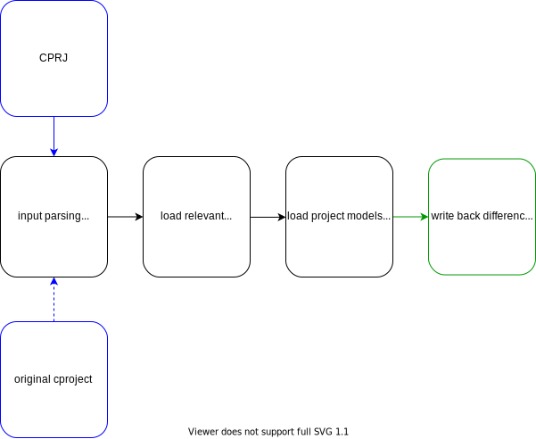
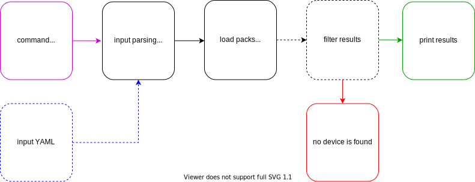
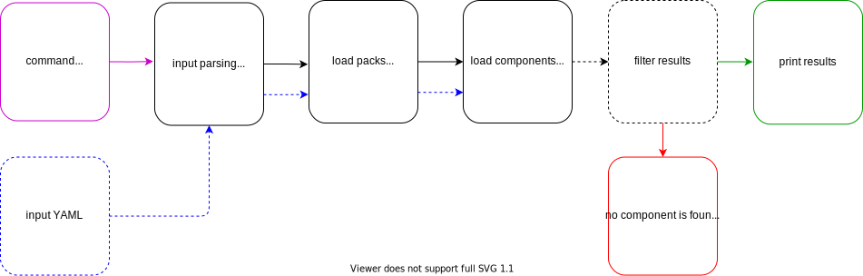
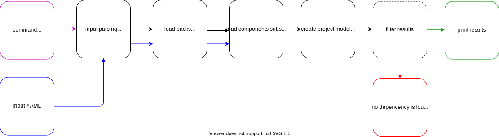
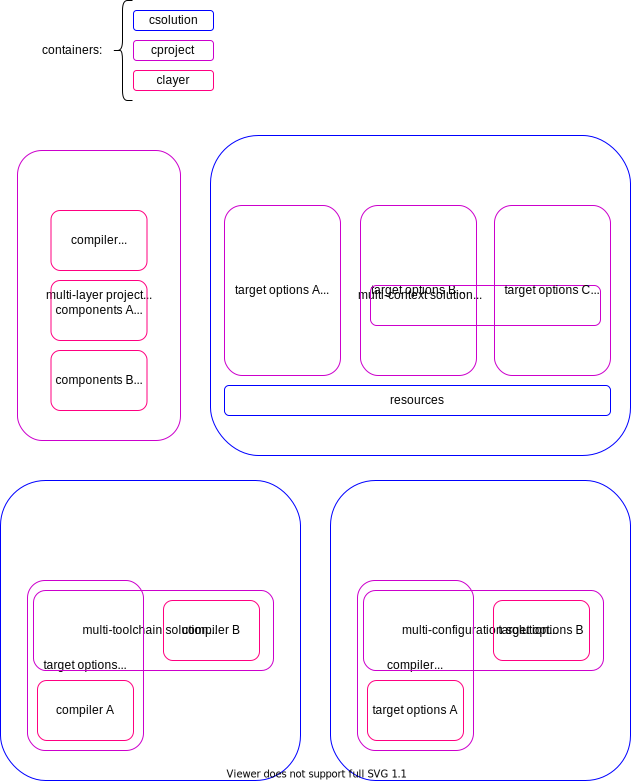

# [DRAFT] CMSIS Project Manager - Software Design 

## Table of Contents

[Introduction](#introduction)

[Design Overview](#design-overview)

[Use cases](#use-cases)
- [ Use Case 1](#use-case-1)
- [ Use Case 2](#use-case-2)

[System Architecture](#system-architecture)

[System Interfaces](#system-interfaces)

[Input YAML Files](#input-yaml-files)


## Introduction

The CMSIS Project Manager is a C++ utility provided as binary and as library with interfaces for the most common programming languages and platforms.
It leverages open source C++ libraries available in the [Open-CMSIS-Pack devtools](https://github.com/Open-CMSIS-Pack/devtools) repository.</br>
The tool assists the embedded software developer in the project creation by exposing available features
from installed CMSIS Packs such as devices and components, allowing to search them using free text filters in addition to standard PDSC attributes. It also validates input files that are written in a
human friendly YAML format following pre-defined schemas and it checks the correctness of components selection and unresolved missing dependencies.</br>

It accepts several input files:
| File             | Description
|:-----------------|:---------------------------------------------------------------------------------
| `.csolution.yml` | Defines the complete scope of the application and the build order of sub-projects
| `.cproject.yml`  | Defines the content of an independent build - directly relates to a `cprj` file
| `.clayer.yml`    | Defines pre-configured files and components for reusing in different solutions
| `.rzone`         | Defines memory and peripheral resources.


## Design Overview

The following diagram illustrates inputs and outputs of the `projmgr` processing:
</br></br>


## Use Cases

The CMSIS Project Manager has two main use cases:
- Backend to synchronize YAML and CPRJ files and related resources.
- Utility to discover available resources and evaluate selected items during project conception.

### Use case 1:
### Synchronize YAML and CPRJ files and related resources

When used as a backend for other tools, such as an IDE or a Build Manager, the most typical use is to generate CPRJs and configuration/resources files, creating complete projects.

</br></br>

### Use case 2:
### Discover project resources and evaluate selected items

</br></br>


## System Architecture

According to the typical use cases some workflows can be defined.</br>
Creating complete projects:
</br></br>

Recreating the `cproject.YAML` files:
</br></br>

Discovering resources (devices, components, dependencies) for assisting the project conception:

List Devices:
</br></br>

List Components:
</br></br>

List Dependencies:
</br></br>


## System Interfaces

The CMSIS Project Manager binaries and libraries are pre-compiled for Windows, Linux and MacOS. The core functions are written in C++ to leverage the already available [Open-CMSIS-Pack/devtools](https://github.com/Open-CMSIS-Pack/devtools) code base.</br>
The library interfaces are generated by the Simplified Wrapper and Interface Generator ([SWIG](http://www.swig.org)). Initially Python interface is provided. SWIG supports several other [scripting languages](http://www.swig.org/compat.html). 


## Input YAML Files

The YAML files support the tags listed below. See the YAML schemas for optional/mandatory and data type requirements.

### csolution.yml

``` yml
created:
  tool: <value>
  timestamp: <value>

info:
  name: <value>
  title: <value>
  description: <value>
  doc: <value>
  category: <value>
  license: <value>

projects:
  - path: <value>
    "$ref": "/cproject" # Reference to cproject.yml schema

resources: # TBD (placeholder)

templates: # TBD (placeholder)
```

### cproject.yml

``` yml
created:
  tool: <value>
  timestamp: <value>
    
info:
  name: <value>
  title: <value>
  description: <value>
  doc: <value>
  category: <value>
  license: <value>

artifacts:
  - label: <value>
    filter: <value>

packages:
  - name: <value>
    vendor: <value>
    version: <value>

compiler:
  name: <value>
  version: <value>

target:
  filter: <value>
  attributes: {<key:value list>}
  output:
    name: <value>
    type: <value>
    outdir: <value>
    intdir: <value>
  includes: [<list>]
  defines: [<list>]
  cflags: 
    add: [<list>]
  cxxflags:
    add: [<list>]
  asflags:
    add: [<list>]
  ldflags:
    add: [<list>]
  arflags:
    add: [<list>]

components:
  - filter: <value>
    attributes: {<key:value list>}
    cflags: 
      add: [<list>]
      remove: [<list>]
    cxxflags:
      add: [<list>]
      remove: [<list>]
    asflags:
      add: [<list>]
      remove: [<list>]
    instances: <value>
    
files:
  - file: <value>
    cflags: 
      add: [<list>]
      remove: [<list>]
    cxxflags:
      add: [<list>]
      remove: [<list>]
    asflags:
      add: [<list>]
      remove: [<list>]
    category: <value>
    path: <value>
    source: <value>
  - group: <value>
    cflags:
      add: [<list>]
      remove: [<list>]
    cxxflags:
      add: [<list>]
      remove: [<list>]
    asflags:
      add: [<list>]
      remove: [<list>]
    files:
      "$ref": "#/files" # Recursive items

layers: 
  - path: <value>
    "$ref": "/clayer" # Reference to clayer.yml schema
```

### clayer.yml

``` yml
created:
  tool: <value>
  timestamp: <value>

info:
  name: <value>
  title: <value>
  description: <value>
  doc: <value>
  category: <value>
  license: <value>

artifacts:
  - label: <value>
    filter: <value>

interfaces:
  provides: {<key:value list>}
  consumes: {<key:value list>}

packages:
  - name: <value>
    vendor: <value>
    version: <value>

compiler:
  name: <value>
  version: <value>

target:
  filter: <value>
  attributes: {<key:value list>}
  output:
    name: <value>
    type: <value>
    outdir: <value>
    intdir: <value>
  includes: [<list>]
  defines: [<list>]
  cflags: 
    add: [<list>]
  cxxflags:
    add: [<list>]
  asflags:
    add: [<list>]
  ldflags:
    add: [<list>]
  arflags:
    add: [<list>]

components:
  - filter: <value>
    attributes: {<key:value list>}
    cflags: 
      add: [<list>]
      remove: [<list>]
    cxxflags:
      add: [<list>]
      remove: [<list>]
    asflags:
      add: [<list>]
      remove: [<list>]
    instances: <value>
    
files:
  - file: <value>
    cflags: 
      add: [<list>]
      remove: [<list>]
    cxxflags:
      add: [<list>]
      remove: [<list>]
    asflags:
      add: [<list>]
      remove: [<list>]
    category: <value>
    path: <value>
    label: <value>
    source: [<list>]
  - group: <value>
    cflags:
      add: [<list>]
      remove: [<list>]
    cxxflags:
      add: [<list>]
      remove: [<list>]
    asflags:
      add: [<list>]
      remove: [<list>]
    files:
      "$ref": "#/files" # Recursive items
```

### created
| Argument        | Description
|:----------------|:----------------------------------------
| tool            | Name of the tool that has written the file. The string shall include version information.
| timestamp       | Date and Time information of the last update. Format: YYYY-MM-DDThh:mm:ss with optional fractional seconds and timezone
<br/>

### info
| Argument        | Description
|:----------------|:----------------------------------------
| name            | Name of the element
| title           | Display name for the element
| description     | Brief description
| doc             | Documentation pointing to *.md file or URL
| category        | Predefined categories
| license         | License ruling according to [spdx license names](https://spdx.org/licenses/)
<br/>

### projects
| Argument        | Description
|:----------------|:----------------------------------------
| path            | Path to `cproject.yml` file
| cproject        | Accept and merge any child item according to `cproject` schema
<br/>

### resources
| Argument        | Description
|:----------------|:----------------------------------------
| TBD (placeholder)          
<br/>

### templates
| Argument        | Description
|:----------------|:----------------------------------------
| TBD (placeholder) 
<br/>

### artifacts
| Argument        | Description
|:----------------|:----------------------------------------
| label           | Unique identifier of an output shared file in the solution context
| filter          | Free text that unambiguously points to a file in the `outdir`
<br/>

### packages
| Argument        | Description
|:----------------|:----------------------------------------
| name            | Name of a required CMSIS Software Pack
| vendor          | Pack's vendor
| version         | Pack's version, which can be a minimum version or a version range
<br/>

### compiler
| Argument        | Description
|:----------------|:----------------------------------------
| name            | Name of a required compiler
| version         | Compiler's version, which can be a minimum version or a version range
<br/>

### target
| Argument        | Description
|:----------------|:----------------------------------------
| filter          | Free text that unambiguously points to device name
| attributes      | Device and board attributes Dvendor, Dname, Pname, [Dfpu](https://arm-software.github.io/CMSIS_5/Build/html/cprj_types.html#DfpuEnum), [Dmpu](https://arm-software.github.io/CMSIS_5/Build/html/cprj_types.html#DmpuEnum), [Dendian](https://arm-software.github.io/CMSIS_5/Build/html/cprj_types.html#DendianEnum), [Dsecure](https://arm-software.github.io/CMSIS_5/Build/html/cprj_types.html#DsecureEnum), [Dmve](https://arm-software.github.io/CMSIS_5/Build/html/cprj_types.html#DmveEnum), Bvendor, Bname, Bversion
| output          | Build output directories, output file and type (executable or library)
| includes        | List of include paths that are valid for the compilation of all modules in the project
| defines         | List of preprocessor definitions that are valid for all project modules undergoing preprocessing
| cflags          | C compiler additional command line options
| cxxflags        | C++ compiler additional command line options
| asflags         | Assembler additional command line options
| ldflags         | Linker additional command line options
| arflags         | Archiver additional command line options
<br/>

### target/output
| Argument        | Description
|:----------------|:----------------------------------------
| name            | Name of the main output file
| type            | Main build artifact type: `lib` for library or `exe` for executable
| intdir          | Relative path of the folder containing intermediate files (such as object files)
| outdir          | Relative path of the folder containing the final build artifacts
<br/>

### components
| Argument        | Description
|:----------------|:----------------------------------------
| filter          | Free text that unambiguously points to a CMSIS Pack component
| attributes      | List of components attributes
| cflags          | C compiler additional command line options
| cxxflags        | C++ compiler additional command line options
| asflags         | Assembler additional command line options
| instances       | Number of instances, only for components that are multi-instance capable
<br/>

### files/file
| Argument        | Description
|:----------------|:----------------------------------------
| file            | Path and name of the file, relative to location of the project file
| cflags          | C compiler additional command line options
| cxxflags        | C++ compiler additional command line options
| asflags         | Assembler additional command line options
| category        | Type of file according to [File Categories](https://arm-software.github.io/CMSIS_5/Build/html/cprj_types.html#FileCategoryEnum)
| path            | Include path for a file with `header` category
| source          | Source path(s) to find source files for a library
<br/>

### files/group
| Argument        | Description
|:----------------|:----------------------------------------
| group           | Unique name of the group of files
| cflags          | C compiler additional command line options
| cxxflags        | C++ compiler additional command line options
| asflags         | Assembler additional command line options
| files           | Unlimited recursive `files` children
<br/>

### layers
| Argument        | Description
|:----------------|:----------------------------------------
| path            | Path to `clayer.yml` file
| clayer          | Accept and merge any child item according to `clayer` schema
<br/>


YAML files can be associated in different ways. In the
following diagrams some common combinations are illustrated.
Several other combinations are possible. 

</br></br>

### Multi-layer project
Everything is described in layers, there is no info at solution and
project level. This approach can be used to easily interchange parts
of project such as supported board, middleware or application.

### Multi-context solution
A bootloader, secure and non-secure projects are part of this
solution, as well as resource files for producing memory and
peripheral configuration via templates processing. Output
artifacts in a project can be labeled for easier integration
as input objects in another project.

### Multi-toolchain solution
In this solution the common parts are described at project level,
while the compiler selection is provided in layers. Any other
toolchain specific project item could be placed in a layer.

### Multi-configuration solution
In this case the target options are separated in layers, for example
Debug/Release configurations would have different compiler options
for optimization and for inclusion of debug information in the image. As in the previous example, any other specific configuration project item could be shifted to the layer level.
